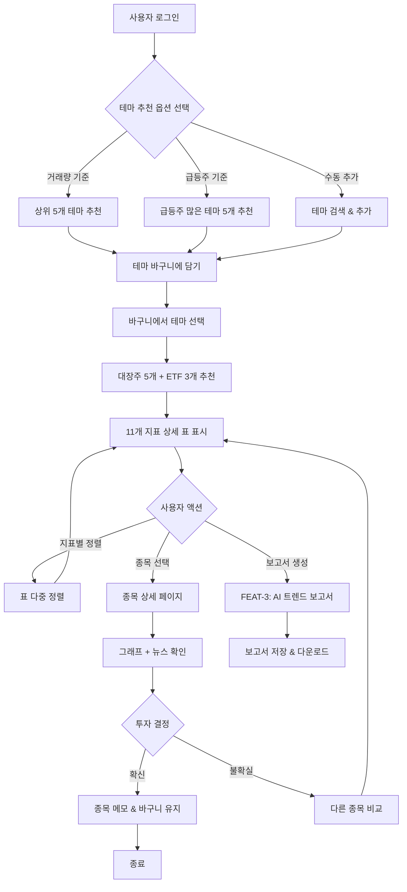
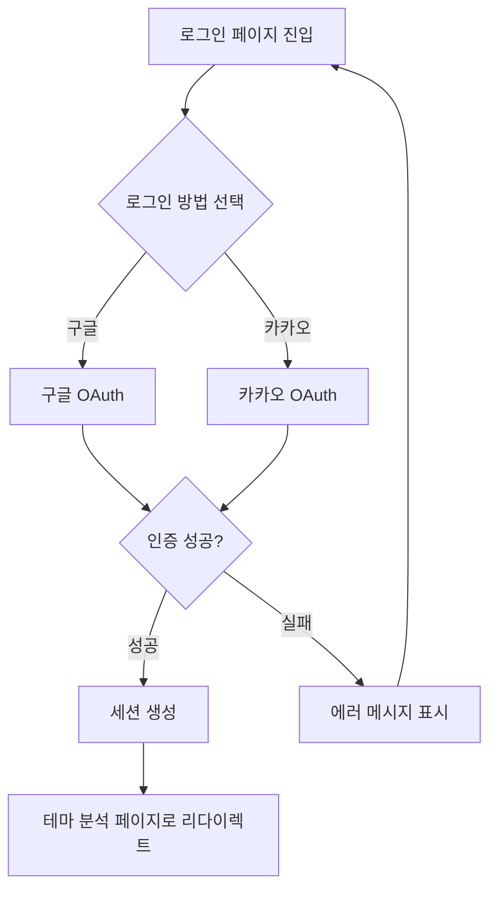
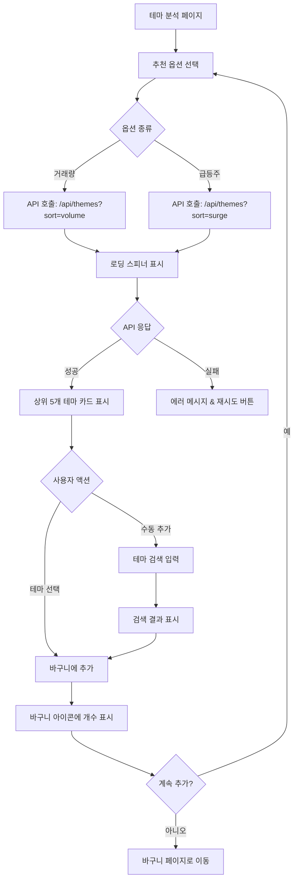

# User Flow (사용자 흐름도)

**프로젝트**: Theme Analysis Program (TAP)  
**버전**: v1.0  
**작성일**: 2026-02-10

---

## 1. 전체 사용자 여정 개요

TAP의 핵심 사용자 여정은 **테마 발견 → 종목 분석 → 투자 결정**의 3단계로 구성됩니다.

```
로그인 → 테마 추천 → 바구니 담기 → 종목 분석 → 상세 확인 → 투자 결정
```

---

## 2. FEAT-1 + FEAT-2: 테마 분석 → 종목 선택 흐름

### Mermaid 다이어그램



---

## 3. 주요 화면별 상세 플로우

### 3.1 로그인 화면



**주요 분기점**:
- 인증 실패 시 에러 메시지 표시 후 재시도
- 첫 로그인 시 닉네임 설정 화면 추가 (선택)

---

### 3.2 테마 분석 화면 (FEAT-1)



**주요 상태**:
- **로딩**: 스피너 + "테마를 분석하고 있습니다..." 메시지
- **성공**: 테마 카드 (이름, 거래량, 급등주 수, "바구니 담기" 버튼)
- **에러**: "테마를 불러오는 데 실패했습니다. 다시 시도해주세요." + 재시도 버튼

---

### 3.3 바구니 & 종목 분석 화면 (FEAT-2)

```mermaid
graph TD
    A[바구니 페이지] --> B[담긴 테마 목록 표시]
    B --> C{테마 선택}
    
    C --> D[API 호출: /api/themes/{id}/stocks]
    D --> E[로딩 스피너]
    
    E --> F{API 응답}
    F -->|성공| G[대장주 5개 + ETF 3개 표시]
    F -->|실패| H[에러 메시지]
    
    G --> I[11개 지표 데이터 테이블]
    I --> J{사용자 액션}
    
    J -->|헤더 클릭| K[단일 정렬]
    J -->|Shift+헤더 클릭| L[다중 정렬]
    J -->|종목 행 클릭| M[종목 상세 페이지]
    
    K --> I
    L --> I
    
    M --> N[종목 상세 정보 로딩]
    N --> O[차트 + 뉴스 표시]
```

**데이터 테이블 기능**:
- **정렬**: 헤더 클릭 시 오름차순/내림차순 토글
- **다중 정렬**: Shift 키를 누른 채 여러 헤더 클릭
- **필터**: 검색 입력으로 종목명 필터링 (선택)
- **반응형**: 모바일에서 가로 스크롤 가능

---

### 3.4 종목 상세 화면

```mermaid
graph TD
    A[종목 상세 페이지] --> B[API 호출: /api/stocks/{code}]
    B --> C[로딩 스피너]
    
    C --> D{API 응답}
    D -->|성공| E[종목 정보 표시]
    D -->|실패| F[에러 메시지]
    
    E --> G[차트 렌더링]
    E --> H[뉴스 목록 표시]
    
    G --> I{차트 인터랙션}
    I -->|기간 변경| J[1일/1주/1개월/3개월]
    I -->|지표 토글| K[이동평균선 ON/OFF]
    
    H --> L{뉴스 클릭}
    L --> M[새 탭에서 뉴스 열기]
    
    E --> N{사용자 액션}
    N -->|메모 작성| O[메모 저장]
    N -->|뒤로가기| P[종목 분석 화면으로]
```

**차트 기능**:
- **기본**: 기준가 (캔들스틱), 거래량 (막대 그래프)
- **지표**: 이동평균선 (5일, 20일, 60일)
- **기간**: 1일, 1주, 1개월, 3개월 선택

---

## 4. FEAT-3: AI 보고서 생성 플로우 (후순위)

```mermaid
graph TD
    A[종목 분석 화면] --> B[보고서 생성 버튼 클릭]
    B --> C{보고서 타입 선택}
    
    C -->|테마 보고서| D[API: /api/reports/theme/{id}]
    C -->|종목 보고서| E[API: /api/reports/stock/{code}]
    
    D --> F[로딩 스피너: AI가 분석 중...]
    E --> F
    
    F --> G{API 응답}
    G -->|성공| H[보고서 표시]
    G -->|실패| I[에러 메시지]
    
    H --> J{사용자 액션}
    J -->|다운로드| K[PDF/Markdown 다운로드]
    J -->|공유| L[링크 복사]
    J -->|저장| M[내 보고서에 저장]
```

**보고서 구성**:
1. **요약**: 테마/종목 핵심 요약 (3줄)
2. **최신 트렌드**: 뉴스 기반 분석
3. **투자 포인트**: 긍정/부정 요인
4. **전망**: 단기/중기 전망

---

## 5. 주요 분기점 및 예외 처리

| 분기점 | 조건 | 결과 | 예외 처리 |
|---|---|---|---|
| **테마 추천 옵션** | 거래량 vs 급등주 | 추천 알고리즘 다름 | API 실패 시 재시도 버튼 |
| **지표 정렬** | 11개 지표 중 선택 | 표 재정렬 | - |
| **투자 결정** | 확신 vs 불확실 | 메모 저장 vs 재비교 | - |
| **API 타임아웃** | 응답 시간 > 10초 | 에러 메시지 표시 | 재시도 또는 대체 API |
| **인증 만료** | 세션 만료 | 로그인 페이지로 리다이렉트 | 자동 로그아웃 |

---

## 6. 사용 시나리오별 플로우

### 시나리오 1: 아침 빠른 탐색 (모바일)

```
로그인 → 거래량 기준 추천 → 상위 테마 1개 선택 → 바구니 담기 
→ 대장주 확인 → 거래량 정렬 → 1위 종목 클릭 → 차트 확인 → 메모 작성 → 종료
```

**예상 소요 시간**: 2~3분

---

### 시나리오 2: 주말 복기 분석 (PC)

```
로그인 → 급등주 기준 추천 → 상위 5개 테마 모두 바구니 담기 
→ 각 테마별 대장주 확인 → 11개 지표 다중 정렬 (거래량 + PER) 
→ 상위 3개 종목 상세 확인 → 뉴스 읽기 → AI 보고서 생성 
→ 보고서 다운로드 → 종료
```

**예상 소요 시간**: 20~30분

---

## 7. 모바일 vs PC 화면 차이

| 화면 | PC | 모바일 |
|---|---|---|
| **테마 추천** | 카드 그리드 (3열) | 카드 리스트 (1열) |
| **데이터 테이블** | 11개 지표 모두 표시 | 핵심 5개 지표만 표시 + 가로 스크롤 |
| **차트** | 큰 화면, 인터랙티브 | 터치 제스처 지원 |
| **네비게이션** | 상단 바 고정 | 햄버거 메뉴 |

---

## 8. 에러 상태 및 엣지 케이스

### 에러 메시지 예시

| 상황 | 메시지 | 액션 |
|---|---|---|
| API 타임아웃 | "서버 응답이 지연되고 있습니다. 잠시 후 다시 시도해주세요." | 재시도 버튼 |
| 테마 없음 | "추천할 테마가 없습니다. 수동으로 테마를 추가해보세요." | 검색 입력 표시 |
| 종목 없음 | "이 테마에 속한 종목이 없습니다." | 뒤로가기 버튼 |
| 네트워크 오류 | "인터넷 연결을 확인해주세요." | 재시도 버튼 |

### 엣지 케이스

- **바구니 비어있음**: "아직 담긴 테마가 없습니다. 테마를 추가해보세요." + 테마 분석 페이지 링크
- **로그인 안 됨**: 보호된 페이지 접근 시 자동으로 로그인 페이지로 리다이렉트
- **데이터 로딩 중 페이지 이탈**: 로딩 중단, 다음 방문 시 재시도

---

## 9. 접근성 고려사항

- **키보드 탐색**: Tab 키로 모든 인터랙티브 요소 접근 가능
- **스크린 리더**: ARIA 라벨 추가 (버튼, 링크, 입력 필드)
- **포커스 표시**: 키보드 포커스 시 명확한 링 표시
- **색상 대비**: WCAG AA 기준 충족 (4.5:1)

---

## 10. 성능 최적화 전략

- **지연 로딩**: 차트는 뷰포트에 들어올 때만 렌더링
- **캐싱**: 테마 목록은 5분간 캐싱
- **페이지네이션**: 종목 목록이 100개 이상일 경우 페이지네이션
- **이미지 최적화**: Next.js Image 컴포넌트 사용
