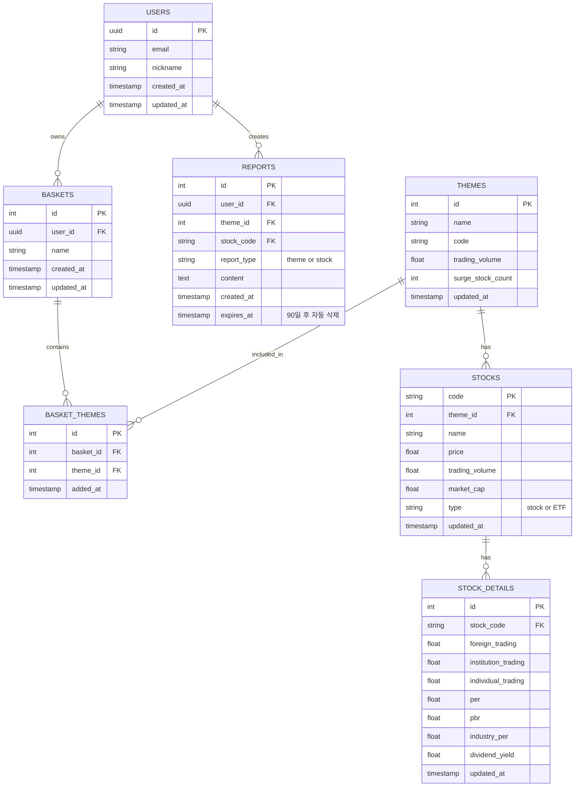

# Database Design (데이터베이스 설계)

**프로젝트**: Theme Analysis Program (TAP)  
**버전**: v1.0  
**작성일**: 2026-02-10  
**DBMS**: PostgreSQL (Supabase)

---

## 1. ERD (Entity Relationship Diagram)

### Mermaid ERD



---

## 2. 테이블 상세 설명

### 2.1 USERS (사용자)

**목적**: 소셜 로그인 사용자 정보 저장

| 컬럼명 | 타입 | 제약조건 | 설명 |
|---|---|---|---|
| `id` | UUID | PRIMARY KEY | Supabase Auth의 user id |
| `email` | VARCHAR(255) | UNIQUE, NOT NULL | 이메일 (소셜 로그인) |
| `nickname` | VARCHAR(50) | NULL | 사용자 닉네임 |
| `created_at` | TIMESTAMP | DEFAULT NOW() | 가입일 |
| `updated_at` | TIMESTAMP | DEFAULT NOW() | 수정일 |

**인덱스**:
- `idx_users_email` ON `email`

**RLS 정책**:
```sql
-- 사용자는 본인 정보만 조회/수정 가능
CREATE POLICY "Users can view own profile"
ON users FOR SELECT
USING (auth.uid() = id);

CREATE POLICY "Users can update own profile"
ON users FOR UPDATE
USING (auth.uid() = id);
```

---

### 2.2 THEMES (테마)

**목적**: 증권 API에서 가져온 테마 정보 저장

| 컬럼명 | 타입 | 제약조건 | 설명 |
|---|---|---|---|
| `id` | SERIAL | PRIMARY KEY | 테마 ID |
| `name` | VARCHAR(100) | NOT NULL | 테마 이름 (예: "2차전지") |
| `code` | VARCHAR(20) | UNIQUE | 테마 코드 (증권사 API) |
| `trading_volume` | BIGINT | DEFAULT 0 | 테마 전체 거래량 |
| `surge_stock_count` | INT | DEFAULT 0 | 급등주 개수 |
| `updated_at` | TIMESTAMP | DEFAULT NOW() | 마지막 업데이트 시간 |

**인덱스**:
- `idx_themes_trading_volume` ON `trading_volume DESC`
- `idx_themes_surge_count` ON `surge_stock_count DESC`
- `idx_themes_updated_at` ON `updated_at DESC`

**RLS 정책**:
```sql
-- 모든 사용자가 테마 조회 가능
CREATE POLICY "Anyone can read themes"
ON themes FOR SELECT
USING (true);
```

**확장 고려사항**:
- 백테스팅을 위해 `theme_history` 테이블 추가 가능 (과거 거래량 기록)

---

### 2.3 STOCKS (종목)

**목적**: 테마별 종목 정보 저장

| 컬럼명 | 타입 | 제약조건 | 설명 |
|---|---|---|---|
| `code` | VARCHAR(10) | PRIMARY KEY | 종목 코드 (예: "005930") |
| `theme_id` | INT | FOREIGN KEY → themes(id) | 소속 테마 |
| `name` | VARCHAR(100) | NOT NULL | 종목명 (예: "삼성전자") |
| `price` | DECIMAL(10,2) | NOT NULL | 현재가 |
| `trading_volume` | BIGINT | DEFAULT 0 | 거래량 |
| `market_cap` | BIGINT | DEFAULT 0 | 시가총액 |
| `type` | VARCHAR(10) | DEFAULT 'stock' | 'stock' 또는 'ETF' |
| `updated_at` | TIMESTAMP | DEFAULT NOW() | 마지막 업데이트 시간 |

**인덱스**:
- `idx_stocks_theme_id` ON `theme_id`
- `idx_stocks_trading_volume` ON `trading_volume DESC`
- `idx_stocks_price` ON `price DESC`
- `idx_stocks_type` ON `type`

**복합 인덱스**:
- `idx_stocks_theme_volume` ON `(theme_id, trading_volume DESC)` — 테마별 대장주 조회 최적화

**RLS 정책**:
```sql
-- 모든 사용자가 종목 조회 가능
CREATE POLICY "Anyone can read stocks"
ON stocks FOR SELECT
USING (true);
```

**확장 고려사항**:
- 백테스팅을 위해 `stock_price_history` 테이블 추가 가능 (일별 시세 기록)

---

### 2.4 STOCK_DETAILS (종목 상세 지표)

**목적**: 종목의 11개 상세 지표 저장

| 컬럼명 | 타입 | 제약조건 | 설명 |
|---|---|---|---|
| `id` | SERIAL | PRIMARY KEY | 상세 정보 ID |
| `stock_code` | VARCHAR(10) | FOREIGN KEY → stocks(code) | 종목 코드 |
| `foreign_trading` | BIGINT | DEFAULT 0 | 외국인 거래량 |
| `institution_trading` | BIGINT | DEFAULT 0 | 기관 거래량 |
| `individual_trading` | BIGINT | DEFAULT 0 | 개인 거래량 |
| `per` | DECIMAL(10,2) | NULL | PER (주가수익비율) |
| `pbr` | DECIMAL(10,2) | NULL | PBR (주가순자산비율) |
| `industry_per` | DECIMAL(10,2) | NULL | 동일업종 PER |
| `dividend_yield` | DECIMAL(5,2) | NULL | 배당수익률 (%) |
| `updated_at` | TIMESTAMP | DEFAULT NOW() | 마지막 업데이트 시간 |

**인덱스**:
- `idx_stock_details_code` ON `stock_code`
- `idx_stock_details_updated_at` ON `updated_at DESC`

**RLS 정책**:
```sql
-- 모든 사용자가 종목 상세 정보 조회 가능
CREATE POLICY "Anyone can read stock details"
ON stock_details FOR SELECT
USING (true);
```

**참고**:
- 그래프와 종목뉴스는 실시간 API 호출로 제공하므로 DB에 저장하지 않음

---

### 2.5 BASKETS (바구니)

**목적**: 사용자가 생성한 테마 바구니

| 컬럼명 | 타입 | 제약조건 | 설명 |
|---|---|---|---|
| `id` | SERIAL | PRIMARY KEY | 바구니 ID |
| `user_id` | UUID | FOREIGN KEY → users(id) | 소유자 |
| `name` | VARCHAR(100) | DEFAULT '내 바구니' | 바구니 이름 |
| `created_at` | TIMESTAMP | DEFAULT NOW() | 생성일 |
| `updated_at` | TIMESTAMP | DEFAULT NOW() | 수정일 |

**인덱스**:
- `idx_baskets_user_id` ON `user_id`
- `idx_baskets_created_at` ON `created_at DESC`

**RLS 정책**:
```sql
-- 사용자는 본인 바구니만 CRUD 가능
CREATE POLICY "Users can manage own baskets"
ON baskets FOR ALL
USING (auth.uid() = user_id);
```

**확장 고려사항**:
- 다중 바구니 지원 (예: "단기 투자", "장기 투자")
- 바구니 공유 기능 (public/private 플래그 추가)

---

### 2.6 BASKET_THEMES (바구니-테마 매핑)

**목적**: 바구니에 담긴 테마 목록 (N:M 관계)

| 컬럼명 | 타입 | 제약조건 | 설명 |
|---|---|---|---|
| `id` | SERIAL | PRIMARY KEY | 매핑 ID |
| `basket_id` | INT | FOREIGN KEY → baskets(id) | 바구니 ID |
| `theme_id` | INT | FOREIGN KEY → themes(id) | 테마 ID |
| `added_at` | TIMESTAMP | DEFAULT NOW() | 추가일 |

**인덱스**:
- `idx_basket_themes_basket_id` ON `basket_id`
- `idx_basket_themes_theme_id` ON `theme_id`

**유니크 제약조건**:
- `UNIQUE(basket_id, theme_id)` — 같은 테마를 바구니에 중복 추가 방지

**RLS 정책**:
```sql
-- 사용자는 본인 바구니의 테마만 관리 가능
CREATE POLICY "Users can manage own basket themes"
ON basket_themes FOR ALL
USING (
  basket_id IN (
    SELECT id FROM baskets WHERE user_id = auth.uid()
  )
);
```

---

### 2.7 REPORTS (AI 보고서) - FEAT-3 후순위

**목적**: AI가 생성한 테마/종목 분석 보고서 저장

| 컬럼명 | 타입 | 제약조건 | 설명 |
|---|---|---|---|
| `id` | SERIAL | PRIMARY KEY | 보고서 ID |
| `user_id` | UUID | FOREIGN KEY → users(id) | 생성자 |
| `theme_id` | INT | FOREIGN KEY → themes(id), NULL | 테마 보고서인 경우 |
| `stock_code` | VARCHAR(10) | FOREIGN KEY → stocks(code), NULL | 종목 보고서인 경우 |
| `report_type` | VARCHAR(10) | NOT NULL | 'theme' 또는 'stock' |
| `content` | TEXT | NOT NULL | 보고서 내용 (Markdown) |
| `created_at` | TIMESTAMP | DEFAULT NOW() | 생성일 |
| `expires_at` | TIMESTAMP | DEFAULT NOW() + 90 days | 만료일 (90일 후 자동 삭제) |

**인덱스**:
- `idx_reports_user_id` ON `user_id`
- `idx_reports_created_at` ON `created_at DESC`
- `idx_reports_expires_at` ON `expires_at` — 자동 삭제용

**RLS 정책**:
```sql
-- 사용자는 본인 보고서만 CRUD 가능
CREATE POLICY "Users can manage own reports"
ON reports FOR ALL
USING (auth.uid() = user_id);
```

**자동 삭제 함수** (Supabase Function):
```sql
-- 매일 자정에 만료된 보고서 삭제
CREATE OR REPLACE FUNCTION delete_expired_reports()
RETURNS void AS $$
BEGIN
  DELETE FROM reports WHERE expires_at < NOW();
END;
$$ LANGUAGE plpgsql;

-- Cron Job 설정 (Supabase 대시보드에서)
-- 매일 00:00에 실행
```

---

## 3. 데이터 흐름

### 3.1 테마 데이터 업데이트 흐름

```
증권 API (pykrx) → Python FastAPI → Supabase (themes, stocks, stock_details)
```

**업데이트 주기**:
- **장 중**: 5분마다 (거래량, 가격 등)
- **장 마감 후**: 1회 (최종 데이터)

**Cron Job 설정**:
```python
# Python FastAPI에서 스케줄러 사용
from apscheduler.schedulers.background import BackgroundScheduler

scheduler = BackgroundScheduler()
scheduler.add_job(update_themes, 'interval', minutes=5)
scheduler.start()
```

---

### 3.2 사용자 데이터 흐름

```
사용자 → Next.js → Supabase (baskets, basket_themes, reports)
```

**실시간 동기화**:
- Supabase Realtime을 사용하여 바구니 변경 시 즉시 반영 (선택)

---

## 4. 데이터 정합성 및 제약조건

### 4.1 외래 키 제약조건

```sql
-- stocks 테이블
ALTER TABLE stocks
ADD CONSTRAINT fk_stocks_theme
FOREIGN KEY (theme_id) REFERENCES themes(id)
ON DELETE CASCADE;

-- stock_details 테이블
ALTER TABLE stock_details
ADD CONSTRAINT fk_stock_details_code
FOREIGN KEY (stock_code) REFERENCES stocks(code)
ON DELETE CASCADE;

-- baskets 테이블
ALTER TABLE baskets
ADD CONSTRAINT fk_baskets_user
FOREIGN KEY (user_id) REFERENCES users(id)
ON DELETE CASCADE;

-- basket_themes 테이블
ALTER TABLE basket_themes
ADD CONSTRAINT fk_basket_themes_basket
FOREIGN KEY (basket_id) REFERENCES baskets(id)
ON DELETE CASCADE;

ALTER TABLE basket_themes
ADD CONSTRAINT fk_basket_themes_theme
FOREIGN KEY (theme_id) REFERENCES themes(id)
ON DELETE CASCADE;

-- reports 테이블
ALTER TABLE reports
ADD CONSTRAINT fk_reports_user
FOREIGN KEY (user_id) REFERENCES users(id)
ON DELETE CASCADE;
```

### 4.2 체크 제약조건

```sql
-- stocks 테이블: type은 'stock' 또는 'ETF'만 허용
ALTER TABLE stocks
ADD CONSTRAINT chk_stocks_type
CHECK (type IN ('stock', 'ETF'));

-- reports 테이블: report_type은 'theme' 또는 'stock'만 허용
ALTER TABLE reports
ADD CONSTRAINT chk_reports_type
CHECK (report_type IN ('theme', 'stock'));

-- reports 테이블: theme_id와 stock_code 중 하나는 반드시 있어야 함
ALTER TABLE reports
ADD CONSTRAINT chk_reports_reference
CHECK (
  (report_type = 'theme' AND theme_id IS NOT NULL AND stock_code IS NULL) OR
  (report_type = 'stock' AND stock_code IS NOT NULL AND theme_id IS NULL)
);
```

---

## 5. 쿼리 최적화 전략

### 5.1 자주 사용되는 쿼리

#### 쿼리 1: 거래량 상위 5개 테마 조회
```sql
SELECT id, name, trading_volume, surge_stock_count
FROM themes
ORDER BY trading_volume DESC
LIMIT 5;
```

**최적화**: `idx_themes_trading_volume` 인덱스 사용

---

#### 쿼리 2: 테마별 대장주 5개 + ETF 3개 조회
```sql
-- 대장주 5개
SELECT code, name, price, trading_volume, market_cap
FROM stocks
WHERE theme_id = ? AND type = 'stock'
ORDER BY trading_volume DESC
LIMIT 5;

-- ETF 3개
SELECT code, name, price, trading_volume, market_cap
FROM stocks
WHERE theme_id = ? AND type = 'ETF'
ORDER BY trading_volume DESC
LIMIT 3;
```

**최적화**: `idx_stocks_theme_volume` 복합 인덱스 사용

---

#### 쿼리 3: 종목 상세 정보 조회 (11개 지표)
```sql
SELECT 
  s.code, s.name, s.price, s.trading_volume, s.market_cap,
  sd.foreign_trading, sd.institution_trading, sd.individual_trading,
  sd.per, sd.pbr, sd.industry_per, sd.dividend_yield
FROM stocks s
LEFT JOIN stock_details sd ON s.code = sd.stock_code
WHERE s.code = ?;
```

**최적화**: `idx_stock_details_code` 인덱스 사용

---

### 5.2 N+1 문제 방지

**문제**: 바구니의 모든 테마를 조회할 때 각 테마마다 별도 쿼리 실행

**해결**: JOIN을 사용한 한 번의 쿼리
```sql
SELECT t.id, t.name, t.trading_volume
FROM basket_themes bt
JOIN themes t ON bt.theme_id = t.id
WHERE bt.basket_id = ?;
```

---

## 6. 백업 및 복구 전략

### 6.1 백업 주기
- **자동 백업**: Supabase에서 매일 자동 백업 (무료 플랜: 7일 보관)
- **수동 백업**: 주요 업데이트 전 수동 백업

### 6.2 복구 시나리오
- **데이터 손실**: Supabase 대시보드에서 특정 시점으로 복구
- **테이블 삭제**: 백업에서 특정 테이블만 복구

---

## 7. 확장 고려사항

### 7.1 포트폴리오 추적 (v2.0)

**추가 테이블**: `portfolios`
```sql
CREATE TABLE portfolios (
  id SERIAL PRIMARY KEY,
  user_id UUID REFERENCES users(id) ON DELETE CASCADE,
  stock_code VARCHAR(10) REFERENCES stocks(code),
  quantity INT NOT NULL,
  avg_price DECIMAL(10,2) NOT NULL,
  purchased_at TIMESTAMP DEFAULT NOW()
);
```

### 7.2 백테스팅 (v2.0)

**추가 테이블**: `theme_history`, `stock_price_history`
```sql
CREATE TABLE theme_history (
  id SERIAL PRIMARY KEY,
  theme_id INT REFERENCES themes(id),
  trading_volume BIGINT,
  recorded_at DATE
);

CREATE TABLE stock_price_history (
  id SERIAL PRIMARY KEY,
  stock_code VARCHAR(10) REFERENCES stocks(code),
  price DECIMAL(10,2),
  trading_volume BIGINT,
  recorded_at DATE
);
```

### 7.3 알림 기능 (v2.0)

**추가 테이블**: `alerts`
```sql
CREATE TABLE alerts (
  id SERIAL PRIMARY KEY,
  user_id UUID REFERENCES users(id) ON DELETE CASCADE,
  theme_id INT REFERENCES themes(id),
  alert_type VARCHAR(20), -- 'surge', 'volume_spike'
  threshold DECIMAL(10,2),
  is_active BOOLEAN DEFAULT true,
  created_at TIMESTAMP DEFAULT NOW()
);
```

---

## 8. 데이터베이스 초기화 스크립트

```sql
-- 1. 테이블 생성 순서 (외래 키 의존성 고려)
CREATE TABLE users (...);
CREATE TABLE themes (...);
CREATE TABLE stocks (...);
CREATE TABLE stock_details (...);
CREATE TABLE baskets (...);
CREATE TABLE basket_themes (...);
CREATE TABLE reports (...);

-- 2. 인덱스 생성
CREATE INDEX idx_themes_trading_volume ON themes(trading_volume DESC);
-- ... (나머지 인덱스)

-- 3. RLS 정책 활성화
ALTER TABLE users ENABLE ROW LEVEL SECURITY;
ALTER TABLE baskets ENABLE ROW LEVEL SECURITY;
ALTER TABLE basket_themes ENABLE ROW LEVEL SECURITY;
ALTER TABLE reports ENABLE ROW LEVEL SECURITY;

-- 4. RLS 정책 생성
CREATE POLICY "Users can view own profile" ON users ...;
-- ... (나머지 정책)
```

---

## 9. 데이터 마이그레이션 전략

### v1.0 → v2.0 마이그레이션 예시

```sql
-- 1. 새 테이블 추가
CREATE TABLE portfolios (...);

-- 2. 기존 데이터 유지
-- (기존 테이블은 변경 없음)

-- 3. 인덱스 추가
CREATE INDEX idx_portfolios_user_id ON portfolios(user_id);

-- 4. RLS 정책 추가
CREATE POLICY "Users can manage own portfolios" ON portfolios ...;
```
